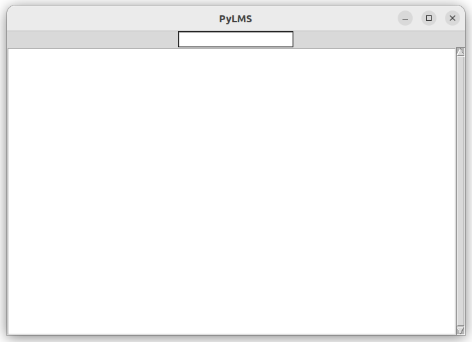

PyLMS
=====

`PyLMS` is a utility to cope with my personal difficulty to remember people's names and relationships, to me and between each other.

* `Py` stands for `Python`: because this is a learning and practicing project: see [Learning through practice](#learning-through-practice)
* `LMS` stands for "**L**acune **M**émorielle **S**ociale" (French for "Social Memory Gap"): see [How it works](#how-it-works)

> [!NOTE]
> Afaik. I invented the terms for "LMS" and "Lacune Mémorielle Sociale". Maybe the name and/or the problem is real thing, but I didn't search.

How it works
============

When `LMS` hits me, the typical questions I ask myself look like:

* "Comment s'appelle le père de Paul?" (What is Paul's father name, already?")
* "Qui est la femme de Remi?" (Who is Remi's wife?)
* "Comment s'appellent les femmes de mon cours d'escalade" (What are the names of the women attending climbing class with me?)

These are basically queries on persons ("Paul", "Remi", "Pierre", "me") and relationships ("père de", "femme de", "femmes de").

Principles
----------

Based on this observation, `PyLMS` stores persons, their relationships and tags in a database. The database is specific to single person (i.e. "me" is implicit).

* Search queries are kind of [telegraphic speech](https://en.wikipedia.org/wiki/Telegraphic_speech): e.g. "père de Paul", "femme de Remi", "femmes cours d'escalade"
* Persons and relationships are created similarly: eg. "Jacques père de Paul", "Emma femme de Remi"
* Persons can also be created and edited directly: e.g. to add/remove tags, fix a typo, change name, ...
* Persons may be Male or Female, to answer queries such as "sœur de" ("sister of") or "fils de" ("son of")
* Sex is computed from a relationship when it carries the information ("père de" -- "father of" -- does, "enfant de" -- "child of" -- doesn't)
* Otherwise, it can be edited directly.

How to use
==========

To successfully help me with LMS, `PyLMS` should be accessible anywhere, and in multiple places: from my laptop to my phone, both online and offline.

However, `PyLMS` is developed in iterations. For now, it has a command-line interface (CLI) and a (minimal) graphical interface (GUI).

Install
-------

see [build](#how-to-build), [run and develop](#how-to-run-and-develop)

CLI Usage
---------

```shell
$ pylms # list all persons (fist name, last name, sex and id) and their relationships
$ pylms john # search a person (or persons) which first name and/or last name contain 'john'
$ pylms create John Doe # create a person with first name 'John' and last name 'Doe'
$ pylms create John # create a person with first name 'John' 
$ pylms link John Doe père de Tony Doe # create a relationship between person matching 'John Doe' and another person matching 'Tony Doe'
$ pylms link John père de Tony # same, only searching with 'John' and 'Tony'
$ pylms delete John # delete the person matching 'John'
$ pylms delete John Doe # delete the person matching 'John Doe'
```

"père de" is an example of a Relationship alias and is looked up to tell apart the Persons in the linking request.
The list of supported relationship alias defined [here](/src/pylms/core.py#L195).

> [!NOTE]
> * Search is case-insensitive and accent-sensitive
> * When searching, in case of multiple matches, user is asked to select the right person (CLI only)
> * When creating a person, there is no duplicate management. Duplicates will have a different id, though.

GUI usage
---------

```shell
pylmsgui
```

PyLMS Gui is minimalistic, a [POC](https://en.wikipedia.org/wiki/Proof_of_concept) for a GUI and [Hexagonal Architecture](https://en.wikipedia.org/wiki/Hexagonal_architecture_(software)).<br/>
It supports the same commands as PyLMS CLI (without the `pylms` prefix), but limited to read-only operations (`list` and `search`) and `create`.



Simply write in the input field and hit `<Return>`.

Persistence
-----------

Data is saved into two JSON files in the working directory: `persons.db` and `relationships.db`.

Development
===========

Status
------

[](https://sonarcloud.io/summary/new_code?id=lesaint_PyLMS)

Requirements
------------

* `Python3` and `pip`
* `Tkinter` and `Tk` to use `pylmsgui` (optional otherwise)
  * on ubuntu, use `sudo apt-get install python3-tk` 
* `make`

How to build
------------

```shell
make build
```

How to run and develop
----------------------

1. see [build](#how-to-build)
2. run with:
    ```shell
    source .venv/bin/activate
    pylms
    ```

Code quality
------------

* code formatted with [`black`](https://black.readthedocs.io/en/stable/) (run `make format`)
* unit tested with `unittest` and `pytest` (run `make test`)
* code quality asserted with [SonarCloud](https://sonarcloud.io/project/overview?id=lesaint_PyLMS) (see [GitHub Actions workflow](.github/workflows/pylms-build.yml))

Licence
=======

GNU GENERAL PUBLIC LICENSE (GPL)

Learning through practice
=========================

As [stated before](#how-to-use), `PyLMS` will be accessible anywhere, in multiple places, and is developed in iterations.
As a consequence, it is a project with superb opportunities to learn:

 * I can start with a simple CLI and evolve the project to an auto-scaling SAAS service running in the Cloud, with both a web interface and an Android application.
 * I can start with a plain JSON file as a database and evolve to Graph Database and a search service supporting Natural Language requests with AI.
 * I can work on both the migrations between each of these steps and keeping them operational concurrently (e.g. the CLI can ultimately become a client to the SAAS service API).

Despite the technical potential, I want to balance it with:

1. functional purpose of the tool as the driver and decision maker of technical changes (i.e. no technical change without user value)
2. my professional centers of interest and my personal strengths: 
    * Deepen my knowledge in Python programming and the Python ecosystem (at some point, I prepared for [PCPP1](https://pythoninstitute.org/pcpp1) with this project)
    * Backend development (I can't deepen into Frontend as much #chooseYourBattles)
    * Application and Architecture design
    * Software Development best practices

Below, I keep track of this learning plan and its progress.

Python Programing
-----------------

* comply with the Zen of Python for [packages and modules](src/pylms), use [`__main__.py`](src/pylms/__main__.py)
* build best practices: `setuptools`, `wheel` (see [setup.cfg](setup.cfg))
* UI development with `tkinter` (PCPP1 certification preparation) (see [gui.py](src/pylms/gui.py))
* Testing with `pytest`, `unitest`, patching, mocks, fixtures for property testing (see [main_test.py](tests/pylms/main_test.py#L20-L43))
* Testing at scale with [Contract Testing](https://pactflow.io/blog/what-is-contract-testing/), [Chaos Testing](https://en.wikipedia.org/wiki/Chaos_engineering) 

Software Engineering best practices
-----------------------------------

* Code Quality: `Black`, `SonarCloud` analysis, [high test coverage](https://sonarcloud.io/summary/new_code?id=lesaint_PyLMS)
* Change management
    * issue tracking with [Linear](https://linear.app)
    * issues described as WHY-WHAT-HOW and as small steps of incremental value ([sample](https://github.com/lesaint/PyLMS/pull/24), [other samples](https://github.com/lesaint/PyLMS/pulls?q=is%3Apr+is%3Aclosed+HOW))
    * code updates with [Pull Requests](https://github.com/lesaint/PyLMS/pulls)
* Continuous Integration: `GitHub actions`

> [!NOTE]
> I selected Linear to explore an innovative approach to issue tracking compared to Jira. Unfortunately, it's private.
> As a workaround, description of [Pull Requests](https://github.com/lesaint/PyLMS/pulls?q=is%3Apr+is%3Aclosed) reproduces the content of issues.

Software Design
---------------

* Implement a [Hexagonal Architecture](https://en.wikipedia.org/wiki/Hexagonal_architecture_(software))
  * in a monolith: [do it in Python](https://github.com/lesaint/PyLMS/pull/13), and [prove it by adding UI without a change to the core](https://github.com/lesaint/PyLMS/pull/27/files)
  * in a system
