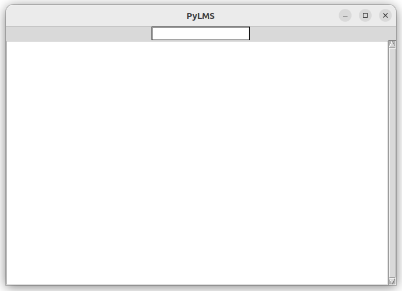

PyLMS
=====

`PyLMS` is a command line tool and a minimalistic UI for `LMS`, named after the common practice to prefix application names with `py` in the `Python` world.

Principles
==========

`PyLMS` stores persons (with first name, last name and sex), their relationships and tags in a database. The database is specific to single person (i.e. "me" is implicit).

* Search queries are kind of [telegraphic speech](https://en.wikipedia.org/wiki/Telegraphic_speech): e.g. "père de Paul", "femme de Remi", "femmes cours d'escalade"
* Persons and relationships are created similarly: eg. "Jacques père de Paul", "Emma femme de Remi"
* Persons can also be created and edited directly: e.g. to add/remove tags, fix a typo, change name, ...
* Persons may be Male or Female, to answer queries such as "sœur de" ("sister of") or "fils de" ("son of")
* Sex is computed from a relationship when it carries the information ("père de" -- "father of" -- does, "enfant de" -- "child of" -- doesn't)
* Otherwise, it can be edited directly.

How to use
==========

Install
-------

see [build](#how-to-build), [run and develop](#how-to-run-and-develop)

CLI Usage
---------

```shell
$ pylms # list all persons (fist name, last name, sex and id) and their relationships
$ pylms john # search a person (or persons) which first name and/or last name contain 'john'
$ pylms create John Doe # create a person with first name 'John' and last name 'Doe'
$ pylms create John # create a person with first name 'John' 
$ pylms update John # to interactively set the first/last name or the tags of the person matching 'John'
$ pylms update John Doe # to interactively set the first/last name or the tags of the person matching 'John Doe'
$ pylms link John Doe père de Tony Doe # create a relationship between person matching 'John Doe' and another person matching 'Tony Doe'
$ pylms link John père de Tony # same, only searching with 'John' and 'Tony'
$ pylms delete John # delete the person matching 'John'
$ pylms delete John Doe # delete the person matching 'John Doe'
```

"père de" is an example of a Relationship alias and is looked up to tell apart the Persons in the linking request.
The list of supported relationship alias defined [here](src/pylms/core.py#L195).

> [!NOTE]
> * Search is case-insensitive and accent-sensitive
> * When searching, in case of multiple matches, user is asked to select the right person (CLI only)
> * When creating a person, there is no duplicate management. Duplicates will have a different id, though.

GUI usage
---------

```shell
pylmsgui
```

PyLMS Gui is minimalistic, a [POC](https://en.wikipedia.org/wiki/Proof_of_concept) for a GUI and [Hexagonal Architecture](https://en.wikipedia.org/wiki/Hexagonal_architecture_(software)).<br/>
It supports the same commands as PyLMS CLI (without the `pylms` prefix), but limited to read-only operations (`list` and `search`) and `create`.



Simply write in the input field and hit `<Return>`.

Persistence
-----------

Data is saved into two JSON files in the working directory: `persons.db` and `relationships.db`.

Development
===========

Status
------

[](https://sonarcloud.io/summary/new_code?id=lesaint_PyLMS)

Requirements
------------

* `Python3` and `pip`
* `Tkinter` and `Tk` to use `pylmsgui` (optional otherwise)
  * on ubuntu, use `sudo apt-get install python3-tk` 
* `make`

How to build
------------

```shell
make build
```

How to run and develop
----------------------

1. see [build](#how-to-build)
2. run with:
    ```shell
    source .venv/bin/activate
    pylms
    ```

Code quality
------------

* code formatted with [`black`](https://black.readthedocs.io/en/stable/) (run `make format`)
* unit tested with `unittest` and `pytest` (run `make test`)
* code quality asserted with [SonarCloud](https://sonarcloud.io/project/overview?id=lesaint_PyLMS) (see [GitHub Actions workflow](../.github/workflows/pylms-build.yml))
